I'm Nicola — founder of **Nic.IA** (Italy). I design and ship **privacy-first AI systems** where the entire stack is mine: the synthetic data, the fine-tuned models, the GPUs they run on, and the agents they power. My method is unusual and I own it proudly: **everything below was built by orchestrating AI agents end-to-end** — architecture, code, training runs, deploys. My craft is directing the machines.

## 🚀 Flagship work

| | |
|---|---|
| 🧠 **[Liara](https://github.com/adoslabsproject-gif/Liara-toolkit)** — your AI, on *your* device | Personal AI assistant running **100% on-device** (Android/macOS/Windows): Rust + llama.cpp in-process, 30-tool ReAct agent with GBNF grammar-constrained calls, encrypted evolving memory, offline voice — and **E2E-encrypted chat where your Liara talks to your contacts' Liara** on your behalf. Custom fine-tunes from 1.2B to 12B. → [nothumanallowed.com/local](https://nothumanallowed.com/local) |
| ⚙️ **[FlowForge](https://flowforge.automazionezeli.com)** — EU workflow automation | Multi-tenant SaaS alternative to n8n/Zapier: **one isolated Docker container per customer**, 190+ nodes, built-in AI assistant that assembles workflows from plain language, embedded DB + RAG. **GDPR-native**: immutable audit log enforced by DB triggers, automatic anonymization, art. 20 export. Live in production. |
| 🤖 **[NotHumanAllowed](https://nothumanallowed.com)** — a platform for AI agents | Security-first network where **agents are the users**: 38 specialized agents, multi-round multi-agent deliberation (proposals → cross-reading → convergence → mediation), Ed25519-signed messages, physically isolated execution tiers. → [repo](https://github.com/adoslabsproject-gif/nothumanallowed) |
| 🛡️ **[Cerbero SENTINEL](https://github.com/adoslabsproject-gif/cerbero-sentinel-waf)** — ML WAF in Rust | 4-layer web application firewall with AI-native defenses: fine-tuned transformer for prompt-injection detection, behavioral anomaly models, coordinated-attack clustering, honeypots. **2–15 ms latency**, 90 tests. Guards everything above. |
| 🔥 **[Liara LLM]** — the model itself | Self-hosted **32B vision-language model** (vLLM, FP8) on EU GPUs + a family of on-device fine-tunes. Own training pipeline: multi-teacher generation, 16 quality gates, SFT + KTO, **system prompt distilled into the weights (−96% tokens)**, QAT/STE for a 1.58-bit ternary model that runs on modest phones. |

## 🧰 More things I've shipped

- **[WebCraft](https://github.com/adoslabsproject-gif/webcraft)** — an AI IDE (Tauri 2 + React 19): Claude Code with a UI.
- **[DataForge](https://github.com/adoslabsproject-gif/dataforge)** — deterministic synthetic-dataset toolkit for tool-calling fine-tuning: SHA-256 reproducible, constant-RAM streaming to millions of examples, anti-template detection, 7 quality gates.
- **[need2talk](https://github.com/adoslabsproject-gif/need2talk)** — enterprise social-audio platform: custom PHP framework, Swoole WebSockets, ML moderation, E2E DMs.
- **[grok-imagine-exporter](https://github.com/adoslabsproject-gif/grok-imagine-exporter)** — Chrome/Firefox extension to bulk-export your Grok Imagine gallery.
- **Medea** — native email client (Tauri 2 + Rust, no Electron) with on-device RAG; **vertical products** for Italian accountants (Odoo) and B2B **zero-knowledge** platforms (Signal Protocol, Shamir recovery).

## 🎯 What I'm best at

**AI engineering & orchestration** — multi-agent systems that actually converge, ReAct agents made reliable on small models (grammar-constrained tool calls, intent guards, consent gates), LLM fine-tuning (LoRA/SFT/KTO/QAT), knowledge distillation, synthetic data pipelines with adversarial quality gates, self-hosted inference (vLLM ↔ llama.cpp, cloud ↔ pocket).

**Systems & security** — Rust (WAF, native apps, inference), TypeScript/Node, Go, Python/ML, .NET; end-to-end encryption (X25519, Signal Protocol), zero-knowledge architectures, hardware keystores; EU-hosted infrastructure with hard tenant isolation.

## 🤝 Want to help?

Liara improves through a simple flywheel: **real people talking to her → better dataset → better models → better conversations.** It's free, anonymous, and the training opt-in is yours to give. If you'd like to volunteer (or just have strong opinions about local AI), come say hi:

**[nothumanallowed.com/local](https://nothumanallowed.com/local)** · **info@zeli.it**

🇮🇹 Parlo italiano — i miei prodotti nascono in italiano prima che in inglese.
